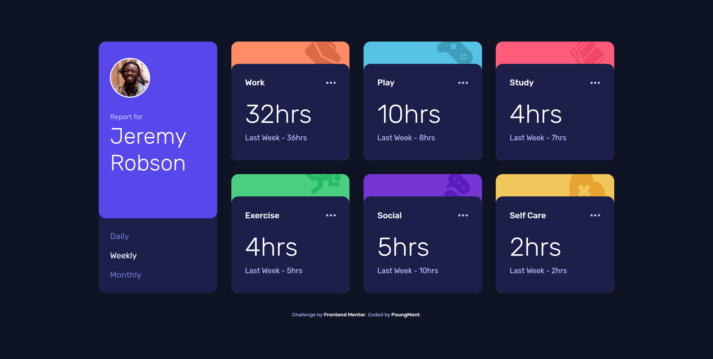
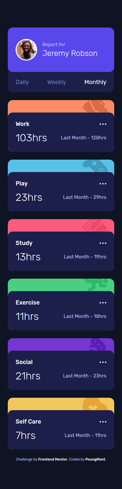

# Frontend Mentor - Time tracking dashboard solution

This is a solution to the [Time tracking dashboard challenge on Frontend Mentor](https://www.frontendmentor.io/challenges/time-tracking-dashboard-UIQ7167Jw). Frontend Mentor challenges help you improve your coding skills by building realistic projects.

## Table of contents

- [Overview](#overview)
  - [The challenge](#the-challenge)
  - [Screenshot](#screenshot)
  - [Links](#links)
  - [Built with](#built-with)
- [Author](#author)

## Overview

### The challenge

Users should be able to:

- View the optimal layout for the site depending on their device's screen size
- See hover states for all interactive elements on the page
- Switch between viewing Daily, Weekly, and Monthly stats

### Screenshot

| Desktop View                                     | Mobile View                                    |
| ------------------------------------------------ | ---------------------------------------------- |
|  |  |

### Links

> **LiveSiteUrl:** Time tracking dashboard on [GitHub Pages](https://thyuhtooaungowo.github.io/Time-tracking-dashboard/)

### Built with

- Semantic HTML5 markup
- CSS custom properties
- Flexbox
- Mobile-first workflow
- Javascript

## Author

- Frontend Mentor - [@ThyuHtooAungOwO](https://www.frontendmentor.io/profile/ThyuHtooAungOwO)
- X - [@PoungMont](https://x.com/Poung_Mont)
